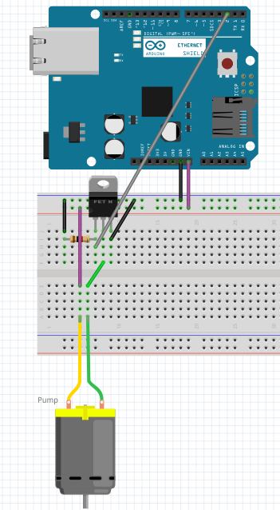
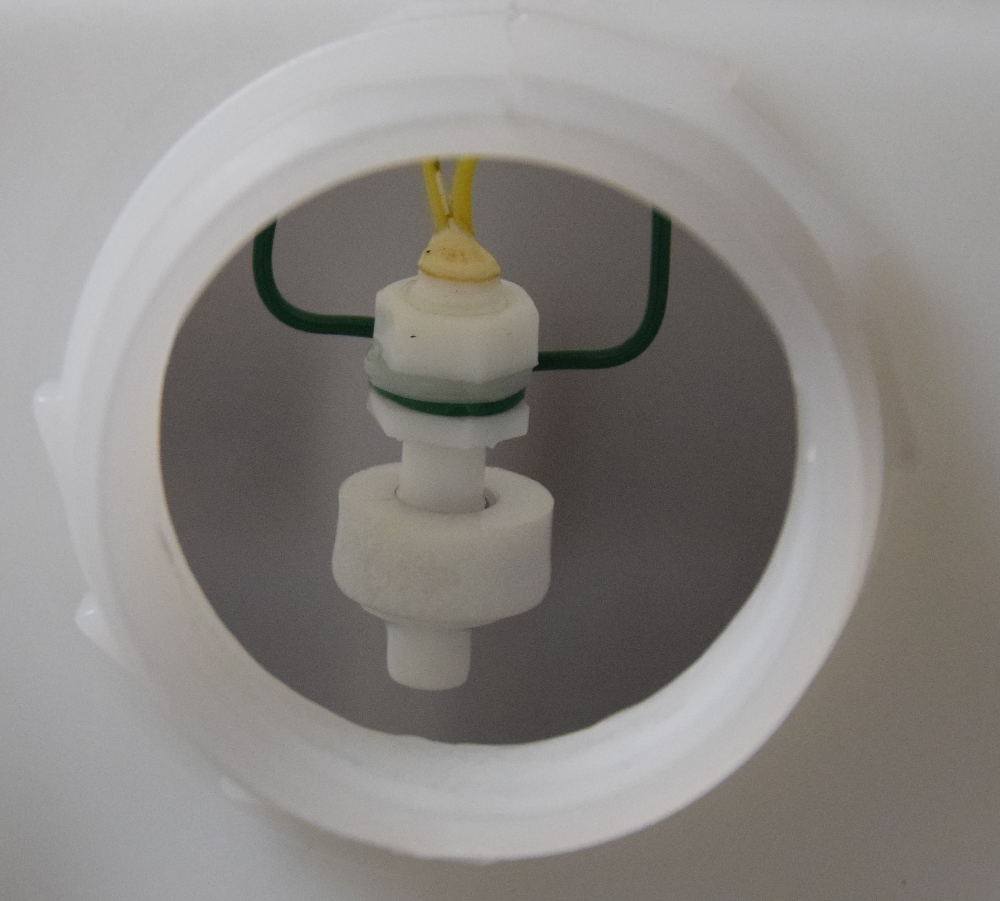
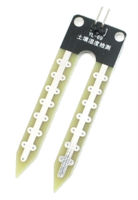

# The automatic plant waterer

## 1. Introduction
At the Athom office we have a very nice planter that adds some greenery to our place of work. However each week one of us needed to manually water the plants. Unacceptable of course, so we set out to automate the process.

## 2. Parts
This project is based around an [Arduino Uno](https://store.arduino.cc/genuino-uno-rev3) combined with an [Arduino Ethernet Shield](https://store.arduino.cc/arduino-ethernet-shield-2).

Required parts
* An [Arduino Uno](https://store.arduino.cc/genuino-uno-rev3)
* An [Arduino Ethernet Shield](https://store.arduino.cc/arduino-ethernet-shield-2)
* A breadboard
* A 12v DC wall-plug adapter
* A small 12v water pump (We've used a [DC-1020 pump from Aliexpress](https://www.aliexpress.com/w/wholesale-dc.html?site=glo&SearchText=dc-1020))
* A piece of tubing
* A N-type mosfet (We've used a HUF75545P3 mosfet)
* A 1KOhm resistor for use with the pump MOSFET

Optional parts
* A [moisture sensor](https://www.aliexpress.com/wholesale?SearchText=moisture+sensor)
* A [float sensor](https://www.aliexpress.com/wholesale?SearchText=float+sensor)
* A 1KOhm resistor per moisture sensor (only needed for the sensors without built-in transistor)
* A 1KOhm resistor for the float sensor (the internal pull-up feature that most Arduino boards have can be used as well)


## 3. Getting a base to work with
To begin we attached our breadboard and our Arduino Uno to a piece of wood using adhesive.
Because the breadboard is attached to our Arduino we can make sure our creation remains stable
during the prototyping phase.

We placed the ethernet shield on top of the Arduino Uno.

## 4. Controlling a pump using an Arduino
The 12v pump can not be connected to the Arduino pin because the pump requires a lot more power than the Arduino can deliver. To amplify the signal from the Arduino pin we will use a N-type mosfet.

Since this project mainly focusses on connecting our planter to Homey we will just give a short description on how we connected everything. For more information on using transistors and mosfets with Arduino we suggest looking for tutorials like the Sparkfun tutorial on using transistors found [here](https://learn.sparkfun.com/tutorials/transistors).



| Arduino pin | Description                                                             |
|-------------|-------------------------------------------------------------------------|
| 2           | Digital output to MOSFET                                                |
| Vin         | Power out to pump (Connected directly to the DC-in jack on the Arduino) |
| GND         | Ground                                                                  |

| MOSFET pin  | Description                                                                                                                                    |
|-------------|------------------------------------------------------------------------------------------------------------------------------------------------|
| GATE        | Control input from Arduino. Connected to ground using a resistor to make sure the MOSFET is off when the Arduino is not driving this pin HIGH. |
| DRAIN       | Current in (from pump)                                                                                                                         |
| SOURCE      | Current out (connected to ground)                                                                                                              |

The pump is connected to the 12v supplied by the wall-plug connected to the Arduino. The other pin of the pump is connected to the DRAIN pin of the MOSFET. The DRAIN pin is used as the power input of the MOSFET. The SOURCE pin of the MOSFET is connected to ground, when a MOSFET is turned-on it will allow current to flow from the DRAIN to the SOURCE pin. The MOSFET is controlled using the GATE pin, which is pulled low by a resistor to disable the MOSFET. When the Arduino sets the I/O pin connected to the GATE of the mosfet to OUTPUT and HIGH the mosfet will switch on. When the pin gets pulled LOW by the Arduino the MOSFET will switch off, thereby functioning as a sort of amplifier/switch combination. This allows the Arduino to control the pump without supplying current to the pump.

After we built the hardware we tested it using the following sketch: this simple sketch should make the pump turn on and off once every second.

```cpp
void setup() {
  pinMode(2, OUTPUT);
}

void loop() {
  digitalWrite(2, HIGH);
  delay(500);
  digitalWrite(2, LOW);
  delay(500);
}
```

This is what our prototype looks like:


## 5. Connecting to Homey

To connect our pump to Homey a bit of code needs to be added to the sketch for the ethernet shield to work:

```cpp
#include <SPI.h>
#include <Ethernet2.h>
#include <EthernetUdp2.h>

byte mac[] = { 0x48, 0x6F, 0x6D, 0x65, 0x79, 0x00 };

void setup() {
  pinMode(2, OUTPUT);

  Serial.begin(115200);

  Serial.println("Starting ethernet..."); //If this is the last message you see appear in the serial monitor...
  Ethernet.begin(mac);

  Serial.print("IP address: ");
  Serial.println(Ethernet.localIP());
}

void loop() {
  //digitalWrite(2, HIGH);
  delay(500);
  digitalWrite(2, LOW);
  delay(500);
}
```

This sketch will connect to your network, print the IP address to the serial monitor and then execute the test program we added earlier.

The next step is adding the Homeyduino library. Until now we've used the ```delay``` function to make the Arduino wait 500ms between each pin update. Since the Arduino does not do anything while it waits it also doesn't handle any network traffic during this time. For Homeyduino it is important to use the ```delay``` function as little as possible, to allow your Arduino to process network packets as often as possible.

To avoid using delays we use the ```millis``` function, this function returns the amount of milliseconds that passed since the Arduino has been turned on. By keeping track of time by comparing the value of ```millis``` instead of just waiting we can make the Arduino handle network packets while waiting. More information on this method can be found [here](https://www.arduino.cc/en/Tutorial/BlinkWithoutDelay).

The following sketch shows how we used ```millis```:

```cpp
#include <SPI.h>
#include <Ethernet2.h>
#include <EthernetUdp2.h>
#include <Homey.h>

byte mac[] = { 0x48, 0x6F, 0x6D, 0x65, 0x79, 0x00 };

unsigned long previousMillis = 0;

uint8_t pumpTimer = 0;

void setup() {
  pinMode(2, OUTPUT);

  Serial.begin(115200);

  Serial.println("Starting ethernet..."); //If this is the last message you see appear in the serial monitor...
  Ethernet.begin(mac);

  Serial.print("IP address: ");
  Serial.println(Ethernet.localIP());

  Homey.begin("planter");
  Homey.addAction("pump", onPump);
  Homey.addAction("stop", onStop);
}

void onPump() {
  pumpTimer = Homey.value.toInt(); //Set the timer

  if ( (pumpTimer<1) || (pumpTimer>30) ) {
    onStop(); //Stop the pump
    return Homey.returnError("Invalid value!");
  }

  Serial.print("Pumping for ");
  Serial.print(pumpTimer);
  Serial.println(" seconds...");

  if (pumpTimer>0) digitalWrite(2, HIGH); //Start the pump
}

void onStop() {
  pumpTimer = 0;
  digitalWrite(2, LOW);
  Serial.println("Pump stopped manually.");
}

void loop() {
  Homey.loop();

  unsigned long currentMillis = millis();

  if (currentMillis-previousMillis >= 1000) { //Code in this if statement is run once every second
    previousMillis = currentMillis;

    if (pumpTimer>0) { //If the pump is active
      pumpTimer = pumpTimer - 1; //Decrease the pump timer
      if (pumpTimer < 1) { //once the timer reaches zero
        digitalWrite(2, LOW); //Turn off the pump
        Serial.println("Pump stopped.");
      } else {
        Serial.print("Pumping for ");
        Serial.print(pumpTimer);
        Serial.println(" more seconds...");
      }
    }
  }
}
```

This sketch allows us to control the pump using Homey. First make sure you have the Homeyduino app installed. After that you can just open the pairing wizard and pair your device.

After pairing the device you can control the pump by adding the device to the action column and selecting the "Action [Number]" flowcard. By selecting the action "pump" and entering a duration in seconds into the value field the pump can be started.

The "stop" action can be used without an argument, it will stop the pump instantly.

## 7. Adding a float sensor
Now that we connected our water pump to Homey we can automatically water our plants, but what about times when the tank becomes empty without us noticing?

To make sure that we are notified of an empty tank and to prevent the pump from running without water (to avoid damage to the pump) we added a float sensor to our setup. The float sensor we bought works as a switch. We suspended the float sensor in our water tank at the correct height by connecting it to a piece of coated iron wire which we cut to length and stuck to the top of the jerrycan with some tape.



Adding the float sensor to our Arduino project is suprisingly simple. The Arduino Uno on which we based this project has an internal pull-up resistor for all it's pins. This means that a resistor in the Arduino can pulls the input to the supply voltage, while the external sensor (which acts like a switch) just pulls the pin down by connecting it to ground.

So the only connections needed to make the float work are as follows:

| Float pin   | Arduino pin      |
|-------------|------------------|
| Wire 1      | Pin 3            |
| Wire 2      | Ground           |

To read the float sensor the pin has to be configured as an input with pull-up enabled.

```cpp
  pinMode(3, INPUT_PULLUP);
```

Reading the sensor can then be done using ```digitalRead(3);```, just like any other input.

Our sensor, which acts like a switch, closes when it is not floating and opens when it is floating. The pull-up pulls the pin high whenever the switch is open, resulting in the following relation:

| Pin state | Meaning                                           |
|-----------|---------------------------------------------------|
| HIGH      | The switch is open, so there is water in the tank |
| LOW       | The switch is closed, so the tank is empty        |

Your sensor could act differently, so you might have to change the sketch a bit to accommodate that instead.

For reading the sensor using Homey we added the following code to our sketch:

```cpp
...
bool previousFloatState = false;
...

void setup() {
  ...
  pinMode(3, INPUT_PULLUP);
  ...
  Homey.addCondition("float", onFloatCondition);
}

void onPump() {
  ...
  if (!previousFloatState) return Homey.returnError("Tank empty!");
  ...
}

void loop() {
  ...
  <in the interval>
    bool currentFloatState = digitalRead(PIN_FLOAT);

    if (previousFloatState != currentFloatState) {
      previousFloatState = currentFloatState;
      Homey.trigger("float", currentFloatState);
      if (!currentFloatState) { //Tank empty
        onStop();
      }
    }
  ...
}

void onFloatCondition() {
  return Homey.returnResult(digitalRead(3));
}
```

This exposes the float sensor both as a trigger and as a condition. Additionally it prevents the pump from running when the tank is empty.


### And on a board that does not have internal pull-up resistors?

Should you want to replicate this on a platform that does not have internal pull-up support then you could replace the functionality using a resistor.

In that case you would still connect the sensor like described earlier, however you would need to add a resistor (with a value of for example 1KOhm) between the input pin on the Arduino and the 5v (or 3.3v, depening on the I/O voltage of your board) supply pin. For most Arduino boards the I/O voltage is 5 volt and for most ESP8266 and ESP32 boards the I/O voltage is 3.3v. Check the I/O voltage before connecting the resistor, for connecting the resistor to the wrong supply voltage could cause damage to your board.

When using an external pull-up resistor the pinMode statement would become like this:

```cpp
  pinMode(3, INPUT);
```

## 6. Adding moisture sensors

When soil becomes moist it's resistance drops. A moisture sensor measures the resistance of the soil between two electrodes at a set distance.

### Types of moisture sensors
Some moisture sensors that you buy from stores like [Sparkfun](https://www.sparkfun.com/products/13322) include a small circuit that consists of a resistor divider with a transistor that amplifies the current flowing through the soil.

Most cheap Chinese sensors however do not include this circuit and consist of two wires at a certain distance from each other. For those sensors we suggest creating a simple voltage divider by connecting the analog input of the Arduino to ground through a resistor and to the supply voltage pin (5v or 3.3v) through the sensor.



### Adding the moisture sensor to the sketch

We connected the moisture sensor to pin A0 on the Arduino.

```cpp
...
int previousMoistureSensorValue = 0;
...

void setup() {
  ...
  pinMode(A0, INPUT);
  ...
  Homey.addCondition("moisture", onMoistureCondition);
}

void loop() {
  ...
  <in the interval>
    bool currentMoistureSensorValue = analogRead(PIN_SENSOR);

    if (previousMoistureSensorValue != currentMoistureSensorValue) {
      previousMoistureSensorValue = currentMoistureSensorValue;
      Homey.trigger("moisture", previousMoistureSensorValue);
    }
  ...
}

void onMoistureCondition() {
  int compareTo = Homey.value.toInt();
  return Homey.returnResult(previousMoistureSensorValue>=compareTo);
}
```

By adding the moisture sensor as a trigger a flow is triggered every time the moisture level changes. This can be used to implement a flow that checks if the moisture level changed below a threshold, allowing Homey to start the pump when necessary. Another approach might be checking of the moisture level as a condition by a flow that is triggered by a time interval, allowing you to make sure the pump isn't started too often.
