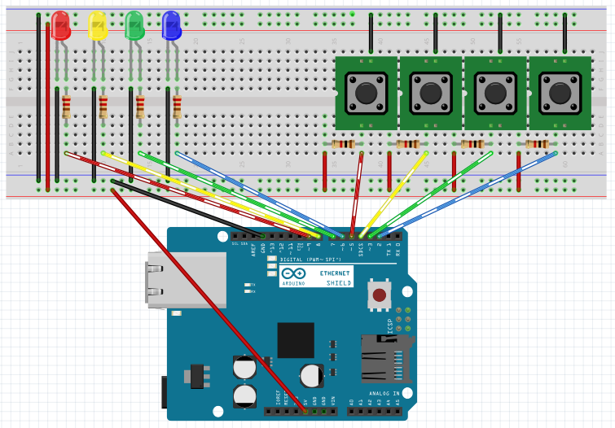
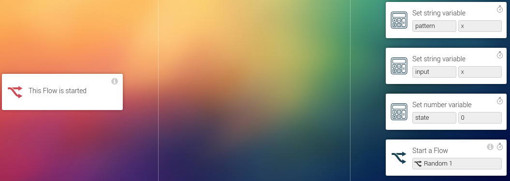
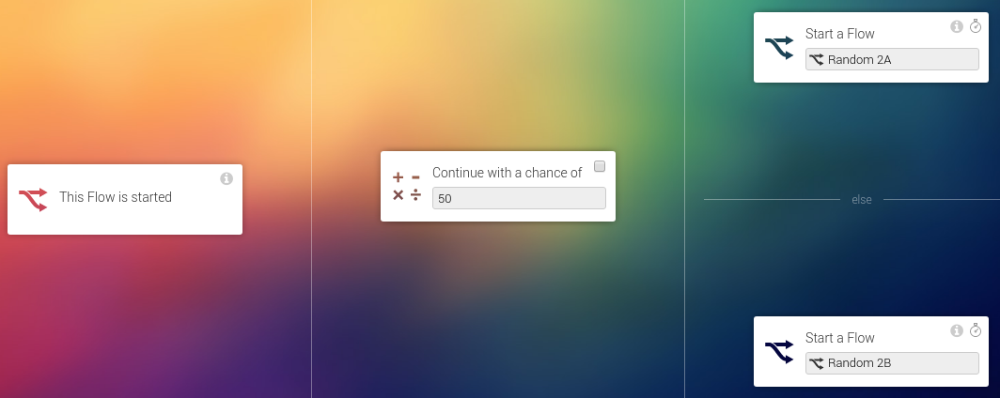
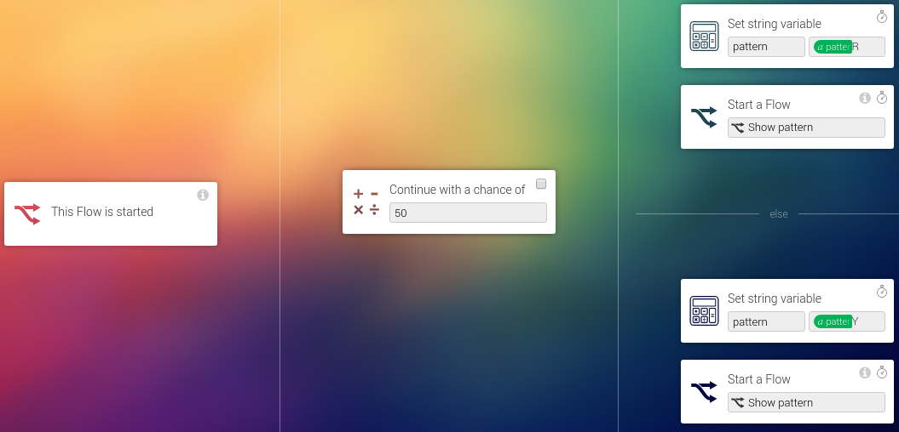
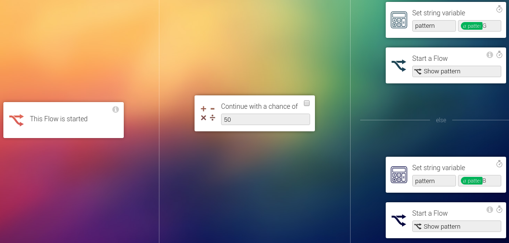
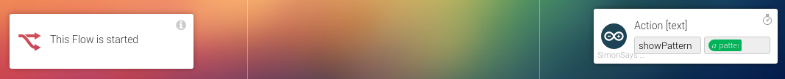
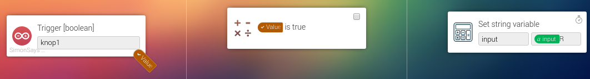
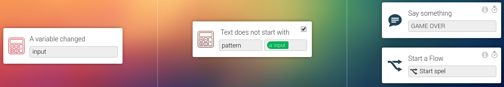
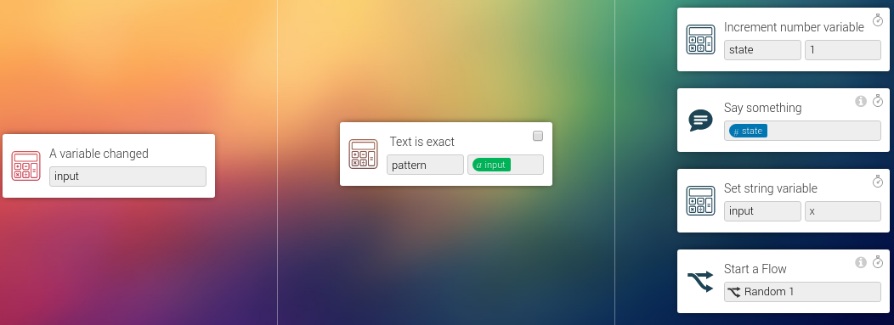

# Simon says

This project was made as a "Hacky Friday" project. On those days the Athom employees work on creating fun projects and on improving the office using those projects.

Since this project was created with the goal of being a hack this description will focus on the tricks used to get to the accomplished result.

## 1. The game
Simon says is a puzzle game consisting of 4 leds and 4 buttons. The leds blink in a pattern, after the pattern has been displayed the player has to repeat that same pattern using the buttons.
The catch is that each turn the pattern gets extended by one step. That means each turn the difficulty of correctly repeating the pattern rises.

## 2. Used hardware

The hardware used for this project consists of:
* An Arduino Uno
* An Arduino ethernet shield v2
* 4 5mm push buttons
* 4 leds
* 4 resistors (choose an appropriate value that matches the leds you chose to use)
* 4 1kOhm resistors for the buttons (optional)
* A breadboard
* A set of breadboard wires

## 3. Building the hardware
The hardware consists of 4 LEDs that show the pattern and 4 buttons on which the user can input the pattern after it has been shown.



This is how we connected the Arduino pins:

| Arduino pin | Direction | Function       |
|-------------|-----------|----------------|
| GND         | -         | Power: ground  |
| 5V          | -         | Power: 5V      |
| 2           | INPUT     | Button: Blue   |
| 3           | INPUT     | Button: Green  |
| 4           | INPUT     | Button: Yellow |
| 5           | INPUT     | Button: Red    |
| 6           | OUTPUT    | LED: Blue      |
| 7           | OUTPUT    | LED: Green     |
| 8           | OUTPUT    | LED: Yellow    |
| 9           | OUTPUT    | LED: Red       |

Note: When using an Arduino board that supports internal pull-up of input pins the external pull-up resistors for the buttons can be removed. Do make sure you select the ```INPUT_PULLUP``` pinmode instead of ```INPUT```.

## 4. The Arduino sketch
Since this project is ment as a weird and "hacky" demonstration of features we will not discuss the basics here. For more information on the basic usage of Homeyduino we recommend reading the documentation and other example projects.

Our goal was to implement all game logic in Homey flows, but because of time restraints we implemented the code responsible for showing a pattern in the Arduino sketch.

### Showing a pattern
To store the pattern we decided to use a String variable. The idea is that the action sent by the Homey flow fills this variable with a string of characters. After that a function that gets called at a regular interval will read the first character from the string and pop it from the string. After that the next time the function executes it will read the next (now first) character. This process repeats itself until the variable is empty.

```cpp
Homey.addAction("showPattern", showPattern);

void showPattern() {
  patternQueue = Homey.value;
}
```
The showPattern function only sets the queue variable.

The real magic happens in the ```runPatternStep()``` function:

```cpp
void runPatternStep() {
  if (patternQueue.length()>0) {
    if (patternState) {
      patternQueue.remove(0,1);
      patternState = false;
      digitalWrite(LED_RED, LOW);
      digitalWrite(LED_YELLOW, LOW);
      digitalWrite(LED_GREEN, LOW);
      digitalWrite(LED_BLUE, LOW);
    } else {
      char color = patternQueue.charAt(0);
      Serial.println(patternQueue);
      if (color=='R') {
        digitalWrite(LED_RED, HIGH);
      } else if (color=='Y') {
        digitalWrite(LED_YELLOW, HIGH);
      } else if (color=='G') {
        digitalWrite(LED_GREEN, HIGH);
      } else if (color=='B') {
        digitalWrite(LED_BLUE, HIGH);
      }
      patternState = true;
    }
  }
}
```
As explained earlier this function reads the first character on the pattern queue and lights up
the LED corresponding to the character on the queue. The next time it is
run the patternState variable being set causes the function to turn off
all leds, while removing the first character of the queue. This means that each two times this function gets called one step gets displayed.

### Reading buttons
Reading the buttons happens as expected: at an interval the pin state gets checked and on change the new value gets transmitted to Homey using ```Homey.trigger()```.

## 5. The Homey flowcards
In this project most of the magic happens using Homey flows. We use variables created using the "Better logic" application to store the game state. One text variable stores the pattern and another text variable stores the user input. Each time the user presses a button the corresponding character gets added to the input variable, after which it is compared to the pattern variable. If the pattern variable begins with the input variable then part of the correct solution has been entered and the user is still busy with entering the pattern. The moment a mismatch occurs the user must have made an error and the game will be ended. When the input variable matches with the pattern variable the user has entered the full pattern correctly, once that happens the game will add a point to the score and add a new character to the pattern variable, after which the new pattern is presented to the user.


 The "magic" begins with a flow we called "Start game". This flow is responsible for resetting the variables for our ```pattern```, ```input``` and ```state```. The state variable is used as a score counter and will start at 0.

 

 Since text variables can't be made empty we used a "x" character as empty variable. Since the "x" is ignored by the runPatternStep() function this does not pose a problem.

The second part of the process is generateing a new random step in the pattern. This is done using three separate flows called ```Random 1```, ```Random 2A``` and ```Random 2B```. The ```Random 1``` flow simply calls either ```Random 2A``` or ```Random 2B``` with a 50% chance.

 

 After that both ```Random 2A``` and ```Random 2B```add a character to the pattern and call the ```Show pattern``` flow. The difference between ```Random 2A``` and ```Random 2B``` being that ```Random 2A```  adds an R or Y character and ```Random 2B``` adds a G or B character.

 

 

The ```Show pattern``` flow in turn sends the ```showPattern``` action to the Arduino board with the ```pattern``` variable as argument.



The next step is user input. Once the user presses (or releases) a button the Arduino sends a trigger to Homey. For each of the four buttons a flow was created:



This flow triggers when the button state changes. The state of the button is then checked to have changed into "pressed" (using the "<boolean> is true" condition flowcard). When this is the case the ```input``` variable is extended with the character corresponding to the button that was pressed (R,Y,G or B).

The next two flows trigger whenever the ```input``` variable is changed. The first flow checks that the  ```pattern``` variable does not begin with the ```input``` variable.

As long as the user enters the correct sequence the (the pattern is for example "xRYG" and the input has become "xR") the flow does nothing, but if the ```pattern``` variable does not begin with the ```input``` variable (```pattern``` being "xRYG" and ```input``` being for example ```xY```) then the game is restarted after having Homey say "Game over".



The second flow checks that the ```input``` variable equals the ```pattern``` variable. If this is the case the user entered the full pattern and the next round may begin. A point is added to the users score and the ```Random 1``` flow gets triggerd, adding another step to the pattern and displaying it to the user.


