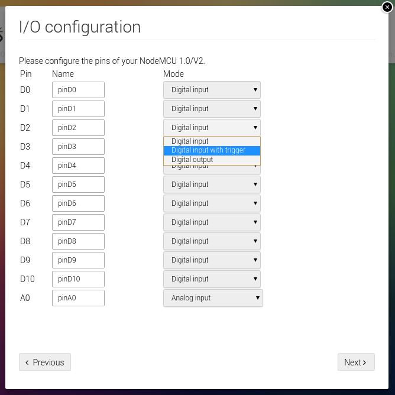

# Remote configuration
Just program the remote configuration sketches into your Arduino boards, and you will be able to configure the boards however you like from within the Homey interface. No programming required.

